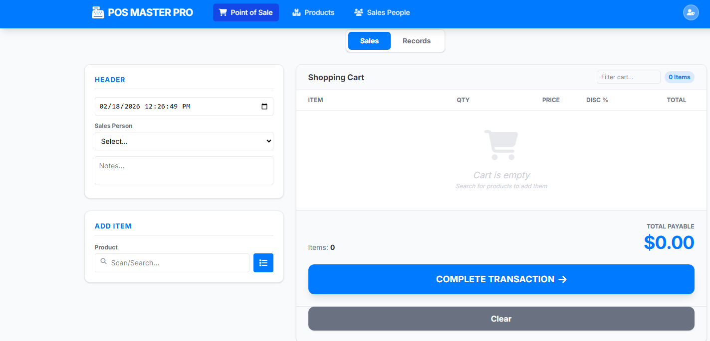
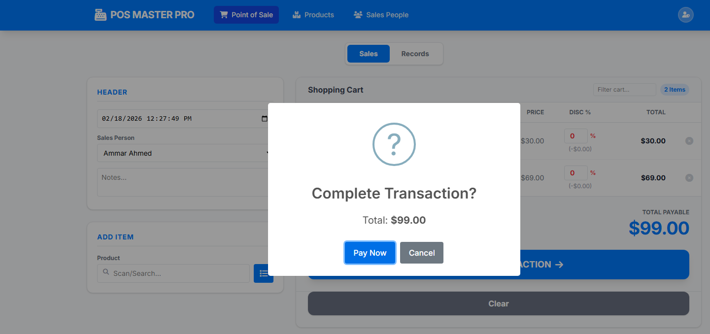
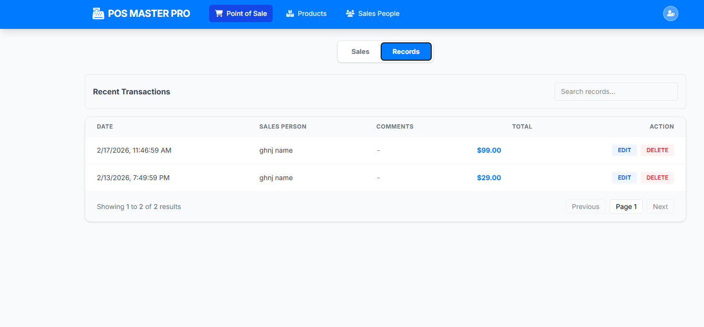
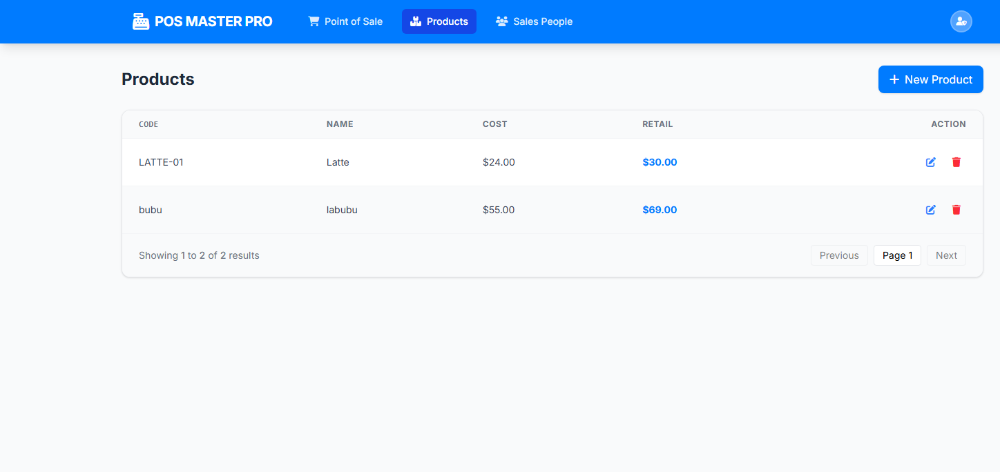

# 🛒 POS Master Pro

> A modern, enterprise-grade **Point of Sale (POS)** system built for performance and scalability.
>
> **Seamlessly integrated with .NET 8 and React 18.**


## 📖 Overview

**POS Master Pro** is a full-stack solution designed to streamline retail operations. It combines a robust, high-performance backend with a sleek, responsive frontend to handle real-time transaction processing, inventory management, and comprehensive sales reporting.

### ✨ Key Features

- **⚡ Real-Time POS Interface:** Fast, interactive cart with dynamic tax and discount calculations.
- **📦 Inventory Management:** Complete CRUD operations for products with real-time stock tracking.
- **👥 Staff Management:** Role-based access control for sales personnel.
- **📊 Transaction History:** Detailed audit logs with capabilities to edit and update past sales.
- **🏗️ Enterprise Architecture:** Built on a "Thin Controller / Rich Service" architecture using the Repository Pattern.

---

## 📸 Screenshots

_Please replace the following placeholders with actual screenshots of your application._

### 🔹 Login / Welcome Screen



### 🔹 POS Dashboard



### 🔹 Sales History



### 🔹 Product Management



---

## 🛠️ Tech Stack

### **Frontend (The View)**

- **Framework:** React 18 (Vite)
- **Styling:** Tailwind CSS v4 + FontAwesome
- **State:** React Hooks & Context API
- **HTTP:** Fetch API with AbortController

### **Backend (The Core)**

- **Framework:** ASP.NET Core 8 Web API
- **Language:** C#
- **Database:** SQL Server
- **Architecture:** Layered (Controller -> Service -> Repository -> DB)
- **Data Access:** ADO.NET / Dapper with Stored Procedures

---

## 🚀 Getting Started

### 1️⃣ Database Setup

1.  Create a database named `POS_DB` in SQL Server.
2.  Run the **[consolidated script](db-scripts/script.sql)** to generate all tables and stored procedures.

### 2️⃣ Backend Setup (API)

Navigate to the `API` directory and follow the instructions.
👉 **[Read API Documentation](API/README.md)**

```bash
cd API
dotnet restore
dotnet run
```

### 3️⃣ Frontend Setup (FE)

Navigate to the `FE` directory and launch the interface.
👉 **[Read Frontend Documentation](FE/README.md)**

```bash
cd FE
npm install
npm run dev
```

---

## 🧠 Architecture Highlights

- **Thin Controllers:** API controllers remain lightweight, handling only HTTP concerns.
- **Rich Services:** Business logic is encapsulated strictly within the Service Layer.
- **Surgical SQL:** Stored Procedures are used for complex data operations to ensure performance and integrity.

## 🤝 Contributing

Contributions, issues, and feature requests are welcome!

## 📝 License

This project is [MIT](LICENSE) licensed.
